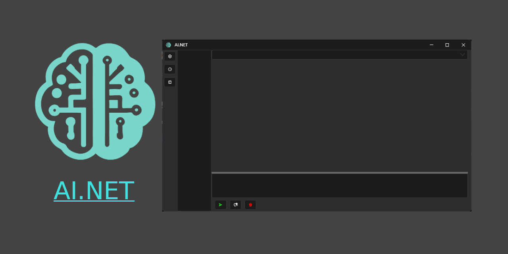

# AI.NET

A .NET AI client, built with WPF.

## Features

- [x] Chat with AI
- [x] Long-term memory with [Mem0](https://github.com/mem0ai/mem0) using [mem0-gui](https://github.com/SamHou0/mem0-gui)
- [x] Custom OpenAI api
- [ ] Reasoning model support
- [x] Chat history management
- [x] System Prompt template

## Usage

Just download and run the app.

## Contributing

- Add feature request and bug reports to help us improve by using [Issues](https://github.com/SamHou0/AI.NET/issues)
- PRs are welcome. See development for more information

### Development

- Visual Studio 2022 with .NET 8.0 SDK

## License

[GNU GENERAL PUBLIC LICENSE](./LICENSE.txt)

## Open-source Libraries

- [HandyControl](https://github.com/HandyOrg/HandyControl)
- [MdXaml](https://github.com/whistyun/MdXaml)
- [OpenAI-Dotnet](https://github.com/openai/openai-dotnet)
- [Log4Net](https://github.com/apache/logging-log4net)
- [FeatherIcons](https://github.com/feathericons/feather)
